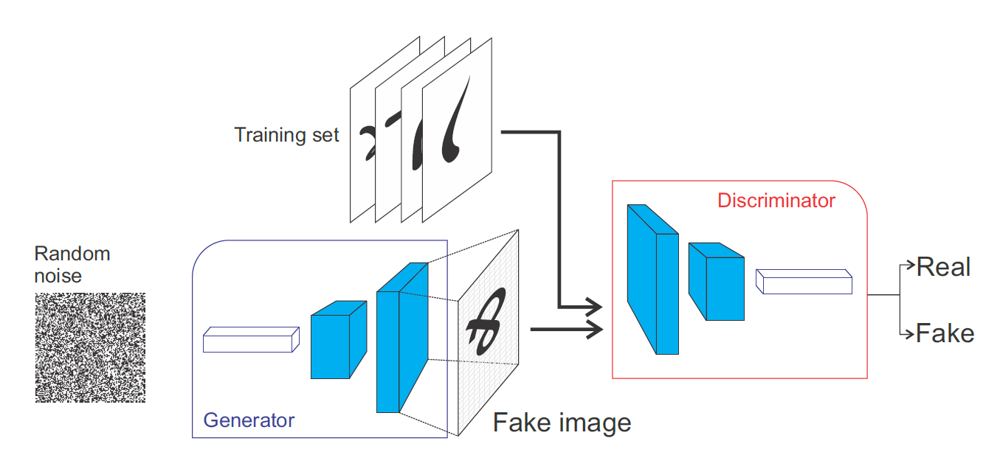
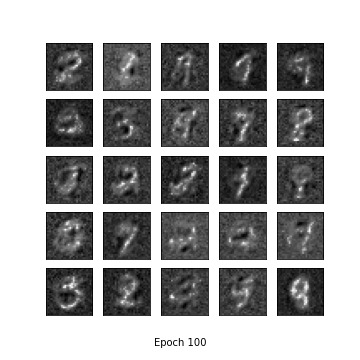

# Generative Adversarial Networks
An implementation of linear GANs using Pytorch. GANs has two submodels: a) **Generator**, and b) **Discriminator**. The Generator model 
tries to create data which is similar to the training dataset. The Discriminator model tries to distinguish between data generated by Generator and from dataset. If the Generator is able to fool Discriminator into making wrong classification, then the Discriminator model is penalized, otherwise penalize the Generator model. We would like to maximize the Discriminator loss, which would lead to a decrease in Generator loss.


## Generator model
The Generator model tries to generate data which has similar distribution when compared to the input data. Here, the generator model is upsampling Dense layers. The input is number of features and the output is image size in the dataset. 
```python
    def linear_block(in_features, out_features, batch_norm=True):
        layers = []
        if batch_norm:
            linear_layer = nn.Linear(in_features, out_features, bias=False)
            batch_norm = nn.BatchNorm1d(out_features)
            layers = [linear_layer, batch_norm]
        else:
            layers.append(nn.Linear(in_features, out_features))
        return nn.Sequential(*layers)

    class Generator(nn.Module):
        def __init__(self, input_features, image_size=28):
            super().__init__()
            output_features = 1 * image_size * image_size # 1 is the number of channels
            self.hcl1 = linear_block(input_features, 256)
            self.hcl2 = linear_block(256, 512)
            self.hcl3 = linear_block(512, 1024)
            self.output = linear_block(1024, output_features)
            self.leaky_relu = nn.LeakyReLU(0.2)
        
        def forward(self, x):
            x = self.leaky_relu(self.hcl1(x))
            x = self.leaky_relu(self.hcl2(x))
            x = self.leaky_relu(self.hcl3(x))
            x = torch.tanh(self.output(x))
            return x
```

## Discriminator model
The Discriminator model tries to classify the input image into real or fake. Real means input data is a sample from training dataset. Fake means input data is gererated by the Generator model. The end goal of Discriminator model is to successfully classify the input images.
```python
    class Discriminator(nn.Module):
        def __init__(self, image_size=28):
            super().__init__()
            input_features = 1 * image_size * image_size
            self.hcl1 = nn.Linear(input_features, 1024)
            self.hcl2 = nn.Linear(1024, 512)
            self.hcl3 = nn.Linear(512, 256)
            self.out = nn.Linear(256, 1)
            self.leaky_relu = nn.LeakyReLU(negative_slope=0.2)
    
        def forward(self, x):
            x = self.leaky_relu(self.hcl1(x))
            x = self.leaky_relu(self.hcl2(x))
            x = self.leaky_relu(self.hcl3(x))
            x = torch.sigmoid(self.out(x))
            return x    
```
## Training
The end goal of GANs is to have a Generator model that has high probability of fooling the Discriminator model. Discriminator model will be given two different inputs, one real inputs and one fake inputs. Real input's labels will be 1, and fake input's labels will be 0.

The optimizers used for both the models is Adam's optimizer with lr=0.0002 while keeping beta1 and beta2 as default.

```python
    def real_loss(predictions):
        batch_size = predictions.shape[0]
        labels = torch.ones(batch_size)
        # We use the binary cross entropy loss | Model has a sigmoid function
        criterion = nn.BCELoss()
        # Move models to GPU if available
        if torch.cuda.is_available():
            labels = labels.cuda()
            criterion = criterion.cuda()
        loss = criterion(predictions.squeeze(), labels)
        return loss

    def fake_loss(predictions):
        batch_size = predictions.shape[0]
        labels = torch.zeros(batch_size)
        criterion = nn.BCELoss()
        # Move models to GPU if available
        if torch.cuda.is_available():
            labels = labels.cuda()
            criterion = criterion.cuda()
        loss = criterion(predictions.squeeze(), labels)
        return loss
```
The Discriminator training will once input the data from training dataset, and another time it will input data generated by the Generator model. The random vector function will return a random sample with guassian distribution. The fake input's(Generator outputs) loss and the real input's(Input dataset) loss of the Discriminator model will be summed up together.
```python
    def train_discriminator(generator, discriminator, optimizer, real_data, batch_size, z_size):
        # Reshape real_data to vector
        real_data = real_data.view(batch_size, -1)
        # Rescale real_data to range -1 - 1
        real_data = scale(real_data)
        
        # Reset gradients and set model to training mode
        optimizer.zero_grad()
        discriminator.train()
        
        # Train on real data
        real_data_logits = discriminator.forward(real_data)
        loss_real = real_loss(real_data_logits, smooth=True)
        # Generate fake data
        z_vec = random_vector(batch_size, z_size)
        fake_data = generator.forward(z_vec)
        # Train on fake data
        fake_data_logits = discriminator.forward(fake_data)
        loss_fake = fake_loss(fake_data_logits)
        # Calculate total loss
        total_loss = loss_real + loss_fake
        total_loss.backward()
        optimizer.step()
        
        return total_loss
```
The Generator model is trained to produce data has very similar distribution when compared to the training dataset. This way the discriminator will have hard time classifying the inputs. For training the Generator is given a random vector which has gaussian distribution. After forward pass the output image generated is then given as input to the Discriminator, the loss from this is then used for backward pass.
```python
    def train_generator(generator, discriminator, optimizer, batch_size, z_size):
        # Reset gradients and set model to training mode
        optimizer.zero_grad()
        generator.train()
        # Generate fake data
        z_vec = random_vector(batch_size, z_size)
        fake_data = generator.forward(z_vec)
        # Train generator with output of discriminator
        discriminator_logits = discriminator.forward(fake_data)
        # Reverse labels
        loss = real_loss(discriminator_logits)
        loss.backward()
        optimizer.step()
        return loss
```

## Output
